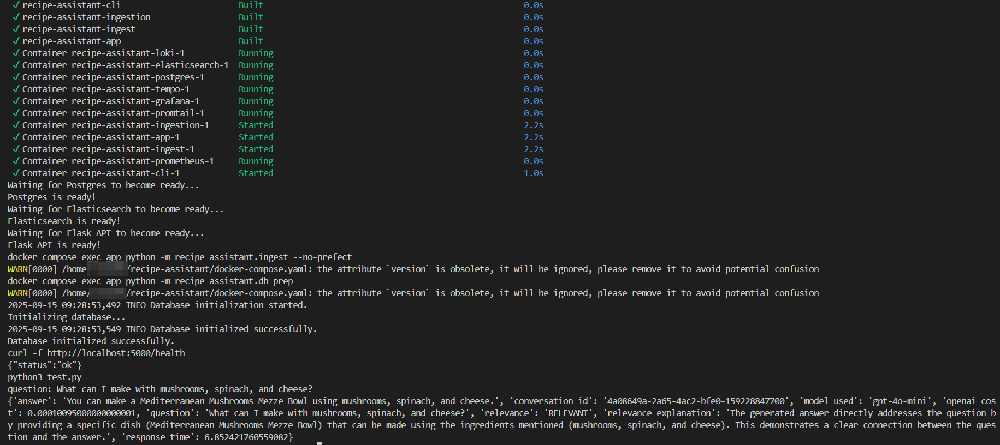

<p align="center">
  
</p>

---


# 🥗 Recipe Assistant: End-to-End RAG System

## Project Objective

**Recipe Assistant** is a full-stack Retrieval-Augmented Generation (RAG) application that recommends recipes based on available ingredients. It demonstrates the complete RAG pipeline: data ingestion, retrieval, prompt engineering, LLM integration, evaluation, monitoring, and deployment—locally and on AWS EC2.

---


## 🧩 Technologies & Procedures Used

- **LLM Integration:** Uses OpenAI GPT-4o (swappable for Ollama, Groq, AWS Bedrock, etc.) for answer generation and prompt engineering.
- **Knowledge Base:** Combines Elasticsearch (vector + keyword search) and Minsearch for hybrid retrieval, document re-ranking, and query rewriting.
- **Interfaces:** Provides a Flask API, CLI, and cURL interface.
- **Ingestion Pipelines:** Multiple approaches—Prefect (workflow orchestration), DLT (declarative, incremental ETL), and custom Python scripts—ensure reproducible, automated data loading.
- **Monitoring & Analytics:** Grafana dashboards (with Prometheus, Loki, Promtail, Tempo, and PostgreSQL) provide full observability. Prometheus scrapes and aggregates metrics from the API, CLI, and ingestion pipelines, which are visualized in Grafana alongside logs and traces. At least 5 charts are included for comprehensive monitoring (feedback, relevance, cost, response time, tokens, model usage, etc.).
- **User Feedback:** Collects and analyzes user feedback to monitor answer quality and relevance.
- **Containerization:** Docker and Docker Compose for full reproducibility and local/remote orchestration.
- **Cloud Deployment:** AWS EC2 and S3 for scalable, cloud-ready operation, with deployment scripts for one-command setup.
- **Reproducibility:** .env.template, Makefile, and Pipfile.lock ensure consistent environments and easy onboarding.
- **Best Practices:** Hybrid search, document re-ranking, query rewriting, advanced logging, and modular code structure.

---


## 🏗️ Architecture Overview

<p align="center">
  
</p>

The architecture diagram above illustrates the end-to-end flow of the Recipe Assistant system:

* **Data Ingestion:** Tools like Prefect, DLT, and custom Python scripts are used to load and process recipe data. This data is then stored in the system’s databases.
* **Storage:** The system uses Elasticsearch for fast vector and keyword search, and PostgreSQL for storing conversations, user feedback, and analytics.
* **API:** A Flask application serves as the main backend interface, connecting the storage layer, LLM, and user interfaces.
* **LLM:** OpenAI (or another LLM provider) is used for answer generation, document reranking, and evaluation of responses.
* **Monitoring:** Grafana provides dashboards for observability, while Loki, Promtail, and Tempo handle log aggregation and distributed tracing. Prometheus collects and scrapes metrics from various components.
* **User Interfaces:** Users can interact with the system via a command-line interface (CLI), cURL commands, or an optional Streamlit web app (not in the project*).
* **Cloud Components:** The entire stack can be deployed on AWS EC2 for scalable compute, with S3 used for storing datasets, logs, and backups.

This modular architecture ensures scalability, observability, and ease of integration for both local and cloud deployments.

> **Note:** A Streamlit web interface is not included in this repository by default, but can be easily added for interactive exploration.

---


## 🧭 Project Structure

```
recipe-assistant/
├── recipe_assistant/      # Main app code (API, RAG, retrieval, db, ingest)
├── ingestion/             # DLT pipeline, data loaders
├── notebooks/             # Data cleaning, RAG flow and evaluation, analytics
├── data/                  # Datasets, embeddings, evaluation results
├── grafana/               # Dashboards, provisioning, Loki/Tempo/Prometheus configs (e.g., prometheus-config.yaml)
├── deployment/            # AWS deployment scripts (e.g., deploy_aws.sh)
├── images/                # Visuals, screenshots, diagrams
├── logs/                  # Application logs
├── Makefile               # Local automation
├── docker-compose.yaml    # Full stack orchestration
├── Dockerfile             # App container
├── Pipfile, Pipfile.lock  # Dependency management
├── generate_feedback.py   # Automated feedback generation script
├── test.py                # API test script
├── plan.md                # Project plan and phases
├── feedback_generation_results.csv # (generated) Feedback results for dashboard analytics
└── README.md              # This file
```

> **Note:** `feedback_generation_results.csv` is generated by the feedback script for dashboard analytics.

---


## 🚀 Quickstart: Local & Remote Testing

### 1. Local Setup (WSL Ubuntu, Linux, MacOS)

#### Prerequisites 
- Docker & Docker Compose
- Python 3.12, pipenv
- OpenAI API key (or compatible LLM)

#### Step-by-Step
```sh
# Clone the repo
$ git clone https://github.com/renelarsson/recipe-assistant.git
$ cd recipe-assistant

# Copy and edit environment variables
$ cp .env.template .env
$ nano .env  # Add your OpenAI key, DB creds, etc.

# Export all variables from .env into the shell environment
$ set -a
$ source .env
$ set +a

# Build and start all services (wait a few seconds for Services to become ready)
$ make up

# Ingest data into Elasticsearch 
$ make ingest

# Initialize the database
$ make db-init

# Check API health
$ make health

# Run a test query
$ make test

# View logs
$ make applog

# Open Grafana for dashboard analytics
$ make grafana

# Run all main targets at once 
$ make all
```

> **Note:** The `make all` command installs Docker, builds the stack, waits for all services (Postgres, Elasticsearch, Flask API) to become ready, initializes the database, ingests data, runs health checks and tests, and prints API/Grafana URLs for dashboard analytics. Sometimes services takes longer. If so, run the targets manually. 


### 2. Remote Deployment (AWS EC2)

#### Prerequisites
- AWS account, EC2 instance (Ubuntu 22.04+), S3 bucket (optional)
- SSH key for EC2 access

#### Step-by-Step
```sh
# SSH into your EC2 instance
$ ssh -i your-key.pem ubuntu@<ec2-public-ip>

# Clone the repo and set up environment
$ git clone https://github.com/renelarsson/recipe-assistant.git
$ cd recipe-assistant
$ cp .env.template .env
$ nano .env  # Add production secrets

# Export all variables from .env into the shell environment
$ set -a
$ source .env
$ set +a
```


---
# Run the deployment script

```sh
$ bash deployment/deploy_aws.sh
```

* Or make the script executable:
```sh
$ chmod +x deployment/deploy_aws.sh
$ ./deployment/deploy_aws.sh
```


---


---


---


- The script installs Docker, builds the stack, waits for services, initializes DB, ingests data, runs a smoke test, and prints API/Grafana URLs for dashboard analytics. 
- After the initial setup, you can use the same Makefile targets described in the local setup section (e.g. make up, make ingest, etc. or make all) to run, monitor, and manage your deployment end-to-end on AWS EC2:

---


After deploying with `deploy_aws.sh`, you can:

- **Check running containers:**
  ```sh
  docker compose ps
  ```

- **Check API health:**
  ```sh
  curl http://localhost:5000/health
  ```

- **Test the API with a sample question:**
  ```sh
  curl -X POST http://localhost:5000/question \
      -H "Content-Type: application/json" \
      -d '{"question": "What can I cook with salmon and broccoli?"}'
  ```

- **View application logs:**
  ```sh
  tail -f logs/app.log
  ```
---


---
- **Export data from Postgres (shown "Example Usage" bellow):**
  ```sh
  make db-shell
  # Then inside the container:
  psql -U your_username -d recipe_assistant
  \copy (SELECT * FROM conversations LIMIT 5) TO 'conversations.csv' CSV HEADER
  \q
  exit
  ```

- **Open Grafana dashboard (see "Monitoring Dashboard" below):**  
  Visit `http://<ec2-public-ip>:3000` in your browser (default user: admin, password: admin).

---


## Automated Feedback Generation (Local Automation)

To generate automated feedback for dashboard metrics, run:

```bash
$ python3 generate_feedback.py
```

This will send 100 random questions to the API, judge the answers with an LLM, and send feedback (+1/-1) accordingly. Results are saved to `feedback_generation_results.csv`.

---


## ⚙️ Makefile Targets for Automation

| Target      | Description                                      |
|-------------|--------------------------------------------------|
| all         | Run all main steps (up, ingest, db-init, health, test) |
| up          | Build and start all services (Docker Compose)     |
| stop        | Stop all running containers                       |
| down        | Stop and remove all services, networks, volumes   |
| build       | Build Docker images only                          |
| restart     | Restart app and grafana containers                |
| logs        | Show all container logs                           |
| app-shell   | Open bash shell in app container                  |
| db-shell    | Open bash shell in postgres container             |
| ingest      | Ingest data into Elasticsearch                    |
| db-init     | Initialize/reset the PostgreSQL database          |
| health      | Check API health endpoint                         |
| dlt         | Run DLT pipeline (analytics data)                 |
| test        | Run test script (API check)                       |
| lint        | Lint Python code with flake8                      |
| applog      | Show application logs (logs/app.log)              |
| grafana     | Open Grafana dashboard in browser                 |

---


## � Example Usage

### 1. Ask a Question via API and Provide Feedback
```bash
$ curl -X POST http://localhost:5000/question \
    -H "Content-Type: application/json" \
    -d '{"question": "What can I cook with chicken, rice, and bell pepper?"}'
```
```bash
$ curl -X POST http://localhost:5000/feedback \
    -H "Content-Type: application/json" \
    -d '{"conversation_id": "PASTE_ID_HERE", "feedback": 1}'
```

## 2. Interact via CLI

Follow these steps to start the stack and use the CLI:

1. **Export environment variables, build, and start all services:**

```sh
   set -a
   source .env
   set +a
   make all
```


---


2. **(Optional) Check that all services are running:**

```sh
docker compose ps
```


3. **Run the CLI in interactive mode:**
```sh
python3 recipe_assistant/cli.py
```


### 3. Export Data from Postgres
```sh
# Run the Postgres container:
$ make db-shell
# Inside the Postgres container run the psql interactive SQL shell:
psql -U your_username -d recipe_assistant
# Inside the psql interactive SQL shell run SQL commands and exit both shells:
\copy (SELECT * FROM conversations LIMIT 5) TO 'conversations.csv' CSV HEADER
\copy (SELECT * FROM feedback LIMIT 5) TO 'feedback.csv' CSV HEADER
\q
exit
```

- Exporting data makes it easy to analyze, visualize, or share results using external tools like spreadsheets or BI platforms.

---


## Monitoring Dashboard


- The above Grafana monitoring dashboard for the Recipe Assistant system illustrates visualized key metrics such as API response times, user feedback scores, model usage, cost, and system health. The dashboard provides real-time insights into system performance, user satisfaction, and resource consumption, helping users monitor and optimize the RAG pipeline.

---


## 📄 License & Attribution

This project is a capstone for the [LLM Zoomcamp](https://datatalks.club/) at DataTalks.Club.
See the main course repo: https://github.com/DataTalksClub/llm-zoomcamp

---